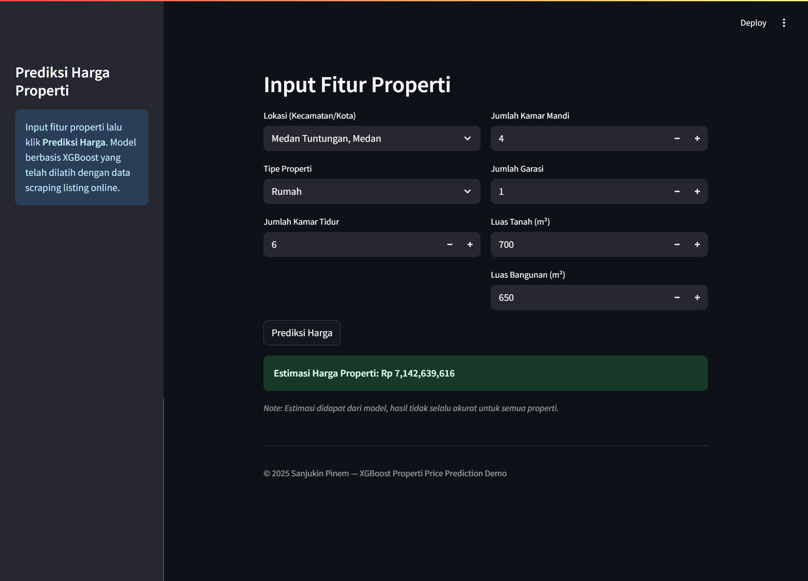

# Prediksi Harga Properti Kota Medan

**End-to-End Data Science Project: Scraping, EDA, Modelling, Deployment**

Dashboard Streamlit:

## 

## 🚀 Deskripsi Singkat

Proyek ini membangun sistem prediksi harga properti di kota Medan (rumah, apartemen, ruko) di Kota Medan. Data diambil dengan scraping dari situs listing properti yakni https://www.rumah123.com, lalu dilakukan proses pembersihan, eksplorasi, pemodelan, hingga deploy model ke dalam dashboard interaktif menggunakan Streamlit.

**Fokus utama:**

- Data acquisition dari web (scraping)
- Data cleaning (harga, luas, missing value, lokasi)
- Machine learning pipeline (XGBoost, tuning, evaluasi multi-metrik)
- Deployment user-friendly

---

## 🛠️ Tech Stack

- **Python**
- **Pandas, Numpy, Scikit-Learn**
- **XGBoost, Optuna**
- **Matplotlib, Seaborn**
- **Streamlit** (dashboard)
- **Joblib** (model serialization)

---

## 📦 Struktur Proyek

```

project-porto-properti/
│
├─ data/                  # Data scraping & hasil cleaning
│    ├─ dataset\_properti\_medan\_raw\_2.csv
│    └─ clean.csv
├─ model/
│    └─ xgb\_model\_pipeline.pkl
├─ src/
│    ├─ (script scraping, EDA, training, dsb)
├─ app.py                 # Dashboard Streamlit
├─ README.md
└─ requirements.txt

```

---

## Cara Menjalankan (Local)

1. **Clone repo dan install requirements:**

   ```sh
   pip install -r requirements.txt
   ```

2. **Jalankan dashboard:**

   ```sh
   streamlit run app.py
   ```

3. **Input fitur properti dan dapatkan estimasi harga.**

---

## Ringkasan Workflow

1. **Data Acquisition**:

   - Web scraping listing properti Medan (format real-world: “Rp 1,5 Miliar”, “luas 200 m²”, dsb).

2. **Data Cleaning & EDA**:

   - Parsing harga dan numerik, imputasi missing value, filtering lokasi, handling outlier (z-score), log transform.
   - Visualisasi distribusi harga, analisis lokasi dan tipe properti.

3. **Feature Engineering**:

   - One-hot encoding lokasi & jenis properti.
   - Scaling numerik.

4. **Modelling**:

   - Model: Linear Regression, Random Forest, XGBoost.
   - Hyperparameter tuning XGBoost (Optuna).
   - Cross-validation (5-fold).
   - Evaluasi: MAE, RMSE, R2, analisis per kategori.

5. **Interpretasi & Deployment**:
   - Analisis feature importance.
   - Dashboard interaktif (Streamlit).

---

## Hasil Utama

- **Model utama:** XGBoost (tuning Optuna)
- **R2 test:** 0.776
- **MAE:** ~Rp 704 juta (30.47% dari harga rata-rata)
- **RMSE:** ~Rp 1.85 M (80% dari harga rata-rata)
- **R2 per kategori:**
  - Apartemen: 0.93
  - Rumah: 0.79
  - Ruko: 0.60

**Fitur paling berpengaruh:** lokasi, jenis properti, luas bangunan, kamar tidur.

---

## Dashboard

- Input: lokasi, tipe properti, kamar tidur/mandi, garasi, luas tanah/bangunan.
- Output: Estimasi harga properti berdasarkan model XGBoost.
- Friendly untuk non-teknis.

---

## Limitasi & Saran Pengembangan

- Model belum memperhitungkan **alamat lengkap**, peta, umur bangunan, atau faktor lingkungan.
- Data diperoleh dari listing publik (bukan appraisal resmi).
- Ke depan bisa tambahkan:
  - Fitur geospasial (jarak ke pusat kota, sekolah, fasilitas umum)
  - Data properti se-Indonesia
  - Model explainability (SHAP)

---

## Author

Sanjukin Pinem  
[LinkedIn](http://linkedin.com/in/sanjukin-pinem-55bb45330/)  
_Email: sanju329121@gmail.com_

---
